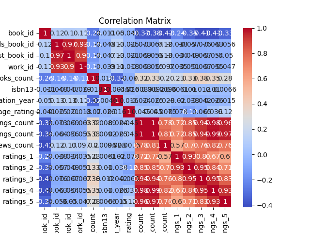
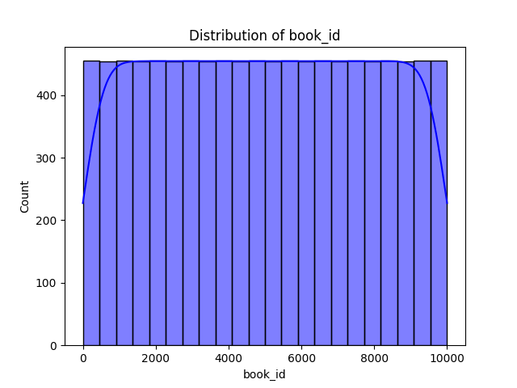

# Automated Dataset Analysis

## Dataset Summary
- Number of Rows: 10000
- Number of Columns: 23
### Columns and Data Types:
- book_id: int64
- goodreads_book_id: int64
- best_book_id: int64
- work_id: int64
- books_count: int64
- isbn: object
- isbn13: float64
- authors: object
- original_publication_year: float64
- original_title: object
- title: object
- language_code: object
- average_rating: float64
- ratings_count: int64
- work_ratings_count: int64
- work_text_reviews_count: int64
- ratings_1: int64
- ratings_2: int64
- ratings_3: int64
- ratings_4: int64
- ratings_5: int64
- image_url: object
- small_image_url: object

## Analysis Narrative
Based on the provided dataset summary, here are some insights and analyses:

### Dataset Overview
- **Total Rows**: 10,000
- **Total Columns**: 23
- This dataset appears to be focused on books, likely sourced from a platform like Goodreads, as indicated by the presence of columns like `goodreads_book_id`, `average_rating`, and `ratings_count`.

### Column Breakdown
1. **Identifiers**:
   - `book_id`, `goodreads_book_id`, `best_book_id`, `work_id`: Unique identifiers for the books.
   
2. **ISBN Information**:
   - `isbn`, `isbn13`: Contains international standard book numbers. Notably, there are missing values for both (700 for `isbn` and 585 for `isbn13`), indicating that a significant number of books do not have these identifiers.

3. **Metadata**:
   - `authors`, `original_title`, `title`, `language_code`: These columns provide descriptive information about the books. The `language_code` has 1,084 missing values, suggesting many books are either not specified or in a language not covered in the dataset.

4. **Publication Information**:
   - `original_publication_year`: There are 21 missing values in this column, which is relatively low. This field is crucial for analyzing trends in publications over time.

5. **Ratings and Reviews**:
   - `average_rating`, `ratings_count`, `work_ratings_count`, `work_text_reviews_count`: These columns are vital for understanding the popularity and reception of the books. Notably, no missing values exist here, suggesting that all entries have been rated.

6. **Rating Breakdown**:
   - `ratings_1`, `ratings_2`, `ratings_3`, `ratings_4`, `ratings_5`: These columns provide detailed insights into how books were rated, allowing for deeper analysis of reader sentiment.

7. **Images**:
   - `image_url`, `small_image_url`: URLs for book cover images, which could be useful for visual representation in any analysis or presentation.

### Missing Values
- Several columns have missing values, which could impact analyses:
  - `isbn`: 700 missing entries could indicate self-published or older books without standard identifiers.
  - `isbn13`: 585 missing entries present a similar challenge.
  - `original_title`: 585 missing entries could affect title searches and comparisons.
  -
## Visualizations
1. Correlation Matrix:

2. Distribution Plot:

