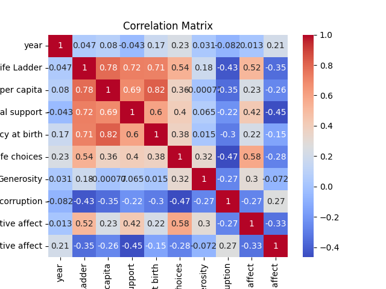
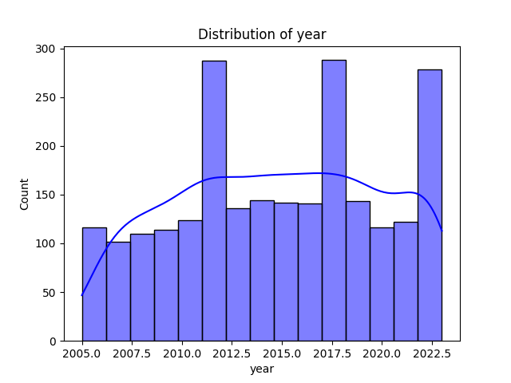

# Automated Dataset Analysis

## Dataset Summary
- Number of Rows: 2363
- Number of Columns: 11
### Columns and Data Types:
- Country name: object
- year: int64
- Life Ladder: float64
- Log GDP per capita: float64
- Social support: float64
- Healthy life expectancy at birth: float64
- Freedom to make life choices: float64
- Generosity: float64
- Perceptions of corruption: float64
- Positive affect: float64
- Negative affect: float64

## Analysis Narrative
Based on the provided summary of the dataset, we have a comprehensive collection of variables related to well-being and socio-economic factors across different countries and years. Here are some key insights and analyses that can be derived from the dataset:

### Overview of Dataset Structure
- **Rows and Columns**: The dataset contains 2,363 rows and 11 columns, indicating a substantial amount of data, which can allow for robust statistical analysis.
- **Columns Description**:
  - **Country name**: Categorical variable representing the countries.
  - **Year**: Integer representing the year of the observation.
  - **Life Ladder**: A continuous variable reflecting subjective well-being.
  - **Log GDP per capita**: A continuous variable indicating the economic performance of a country per capita.
  - Other variables (Social support, Healthy life expectancy, Freedom to make life choices, Generosity, Perceptions of corruption, Positive/Negative affect) provide various dimensions of social and psychological well-being.

### Missing Values
- The dataset has various missing values in several columns:
  - **Log GDP per capita**: 28 missing values.
  - **Social support**: 13 missing values.
  - **Healthy life expectancy at birth**: 63 missing values.
  - **Freedom to make life choices**: 36 missing values.
  - **Generosity**: 81 missing values.
  - **Perceptions of corruption**: 125 missing values.
  - **Positive affect**: 24 missing values.
  - **Negative affect**: 16 missing values.
  
  The presence of missing values in key columns, especially the 'Healthy life expectancy at birth' and 'Perceptions of corruption', may affect the outcome of analyses and requires careful handling, such as imputation or exclusion, depending on the analysis context.

### Sample Data Analysis
- **Life Ladder**: Values range from around 3.724 to 4.758 for Afghanistan from 2008 to 2012. This indicates variability in subjective well-being over the years within a single country.
- **Log GDP per capita**: The values range from approximately 7.35 to 7.661, suggesting a slight increase in economic performance as measured by GDP per capita.
- **Social Support**: The data shows a range from 0.451 to 0.552, indicating a generally low level of social support, which could be a significant factor influencing life satisfaction.
- **
## Visualizations
1. Correlation Matrix:

2. Distribution Plot:

