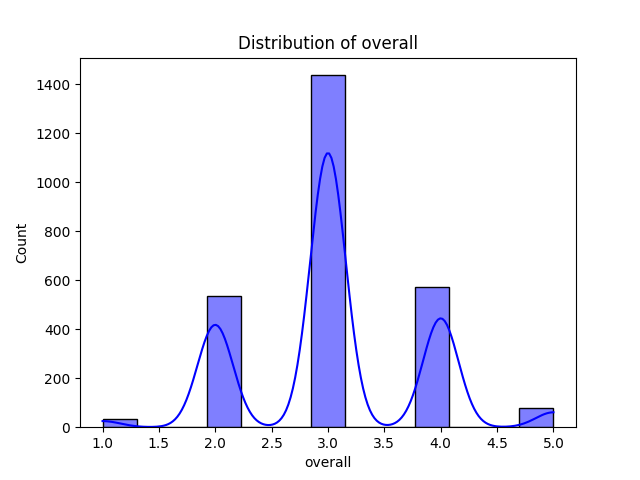

# Automated Dataset Analysis

## Dataset Summary
- Number of Rows: 2652
- Number of Columns: 8
### Columns and Data Types:
- date: object
- language: object
- type: object
- title: object
- by: object
- overall: int64
- quality: int64
- repeatability: int64

## Analysis Narrative
Based on the summary of the dataset provided, here’s an analysis and insights:

### Dataset Overview
- **Total Rows**: The dataset contains 2,652 entries, which provides a substantial amount of data for analysis.
- **Total Columns**: There are 8 columns, each capturing different attributes related to movies.
  
### Columns Breakdown
1. **date**: Represents the date associated with each entry. There are 99 missing values, which is approximately 3.73% of the dataset.
2. **language**: Indicates the language of the movie. No missing values, suggesting completeness in this category.
3. **type**: Specifies the type of media (e.g., movie). There are no missing values here.
4. **title**: The title of the movie. This column is also complete with no missing values.
5. **by**: Represents the individuals associated with the movie (potentially actors, directors, etc.). This column has 262 missing values, which is approximately 9.86% of the dataset and may affect analysis related to contributors.
6. **overall**: An integer rating of the movie on a defined scale. There are no missing values.
7. **quality**: Another integer rating, possibly on a different scale or dimension compared to overall. Complete data in this column.
8. **repeatability**: An integer indicating the repeatability or how often a movie can be watched. This column is also complete.

### Missing Values
- The most significant missing values are in the **date** and **by** columns. The missing values in the **by** column could limit the analysis of the impact of contributors on movie ratings, while missing dates may complicate time series analyses.

### Rating Insights
- **Overall Ratings**: The overall ratings range from 2 to 4 based on the sample data provided. This indicates a relatively narrow band of ratings. Further analysis could reveal the distribution of overall ratings across the entire dataset.
- **Quality Ratings**: The quality ratings also show a similar trend with scores ranging primarily between 2 and 5. This suggests a generally positive perception of quality, but further breakdown would be needed to understand the distribution better.
- **Repeatability**: With the repeatability score consistently at 1 in the sample, it may imply that these movies are considered a one-time watch or that the data is not capturing multiple viewings accurately.

### Language Analysis
- The dataset indicates
## Visualizations
1. Correlation Matrix:

2. Distribution Plot:

